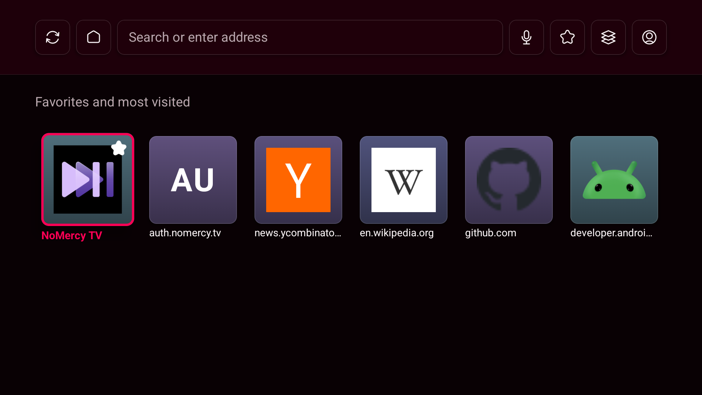
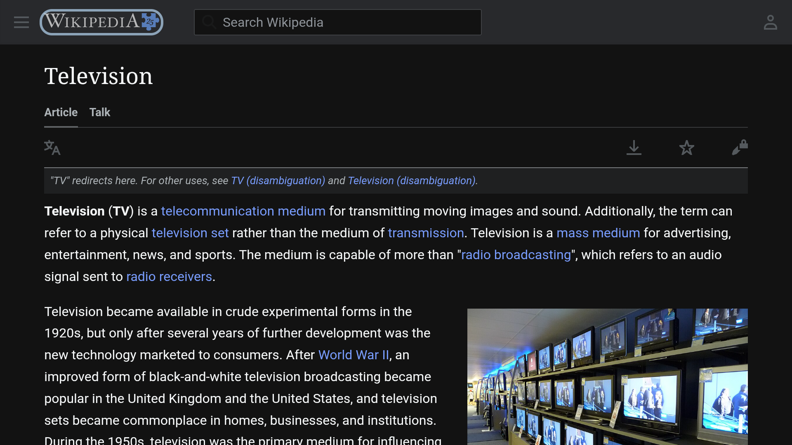
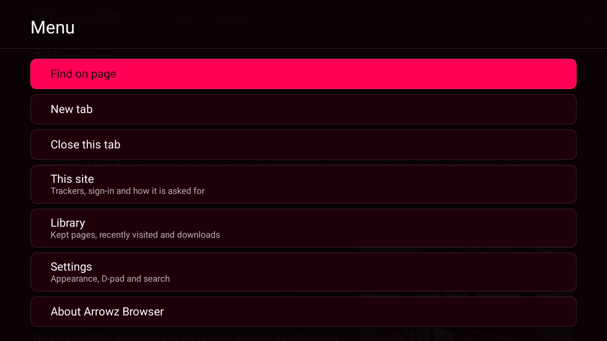

# Arrowz Browser

A web browser for Android TV that is actually operable from a remote, plays media the way a real browser does, and sends nothing about your browsing anywhere.

Most TV browsers fail in the same two places. They fake a mouse badly, so navigating any page is a fight. And they treat video as whatever the system WebView does by default, which means no fullscreen, no now playing, no audio focus and no background audio. This project treats input and media as the product rather than as details.



## What it does

Every function is reachable from six keys: the four directions, OK, and BACK. Pages you can walk by focus get a ring; pages you cannot get a pointer. The browser picks, a long press of OK overrules it, and the menu carries the same switch for anyone who has not been told about the long press. That is what a plain Chromecast voice remote gives you, and it is the floor the whole interface is designed against. Remotes with more buttons are welcome to have them, but nothing is ever hidden behind a key your remote may not have.

Media works the way you expect from a browser on a phone. Video goes fullscreen, playback publishes a real media session so transport controls and headset buttons work, audio focus is respected so the browser does not talk over other apps, and audio keeps playing when you leave the app.

Privacy is the default rather than a setting. There is no analytics code in the project and the build fails if a dependency brings any, WebView's Safe Browsing reporting is turned off, and the app never contacts a server belonging to us. Trackers are blocked out of the box using the public upstream filter lists, downloaded from their own publishers rather than through anything of ours, with a smaller list inside the app so the first page you open is already protected.

## Status

In development, and usable as a daily browser on a television.

What works today: spatial navigation through page content with a focus ring drawn by us, and an accelerating pointer for pages that cannot be walked by focus, with the browser choosing between them and a long press on OK overruling it; tabs that survive memory pressure and rebuild themselves when the system kills a renderer; fullscreen video with a real media session, audio focus and background audio; a native overlay for filling in web forms, including dropdowns a D-pad can operate; tracker blocking from the public filter lists, fetched from their publishers and never through us; a home screen of favorites and most visited; address suggestions; voice input from the remote's microphone; find in page; per-site permissions; downloads and a file chooser; a desktop-or-TV switch remembered per site; links handed over from other apps; and a browser that stands down entirely when a screen reader is running, so one focus system drives the whole interface.

Still ahead: the Play submission itself, which needs a console entry and a service account key.

Features land slice by slice, and each slice is accepted only when everything it added can be reached using six keycodes and nothing else. The design note for each one is in [docs/design](docs/design/).

## Screenshots

Every shot is taken on real hardware rather than an emulator, since the whole point is how this behaves on a television, and on an installation with no browsing history behind it.

| | |
|---|---|
|  |  |
| The home screen: favorites and most visited, reachable from the address bar with one press. | Focus mode on a real page. The ring is ours, drawn to the same token the native chrome uses, because a site's own focus style is frequently invisible at three metres or removed entirely. |



The menu, opened by holding BACK. Every entry acts immediately; there is no second level, because a submenu on a television costs two presses to reach and two to leave.

## Building

You need JDK 21 and an Android SDK with platform 36.

```
./gradlew assembleDebug
adb install -r app/build/outputs/apk/debug/app-debug.apk
```

The app ships no native code of its own. One artifact runs on every processor Android TV uses, so there are no ABI splits to pick between.

Released builds are attached to the [GitHub releases](../../releases) as a signed
AAB for Play and a signed APK for sideloading, with a `SHA256SUMS.txt` beside
them so a download can be checked rather than trusted.

### Driving it on a television

```
node tools/spatial-drive.mjs <serial> <url>
```

Presses real remote keys at a real device and reports where focus went, both
against a debug page carrying every input type a site can use and against the
open web. It is the ruler that catches what the geometry fixtures cannot, and
the reasoning is in
[docs/design/spatial-navigation-on-hardware.md](docs/design/spatial-navigation-on-hardware.md).
On a page carrying one of every input type it reaches 22 of 25 controls by
sweep, and the other three by hand. On a Wikipedia article the column walk
covers 41 stops from the header to the end of the page, reaching 56 of the 58
controls within reach of the viewport, and the page scrolls by what it takes to
show the next one rather than a screenful at a time.

Two things it will not reach, and neither is a navigation defect. A site whose
consent dialog lives in a third-party iframe puts every one of its controls
outside this document, so nothing in the page can see them; the browser counts
what is reachable, finds nothing, and hands that page to the pointer. And the
release build carries no devtools socket because it is not debuggable, so it is
driven by comparing screenshots between presses instead.

## What it cannot do

Netflix, Prime Video and Disney+ refuse to serve browsers, and that is their policy rather than a limitation here. The same is true of Brave on a phone. Other services that use encrypted media play normally.

## Legal

- [Privacy policy](docs/legal/privacy-policy.md)
- [Terms of service](docs/legal/terms-of-service.md)
- [Security policy](SECURITY.md)

## License

MIT. Copyright 2026 NoMercy Labs.
