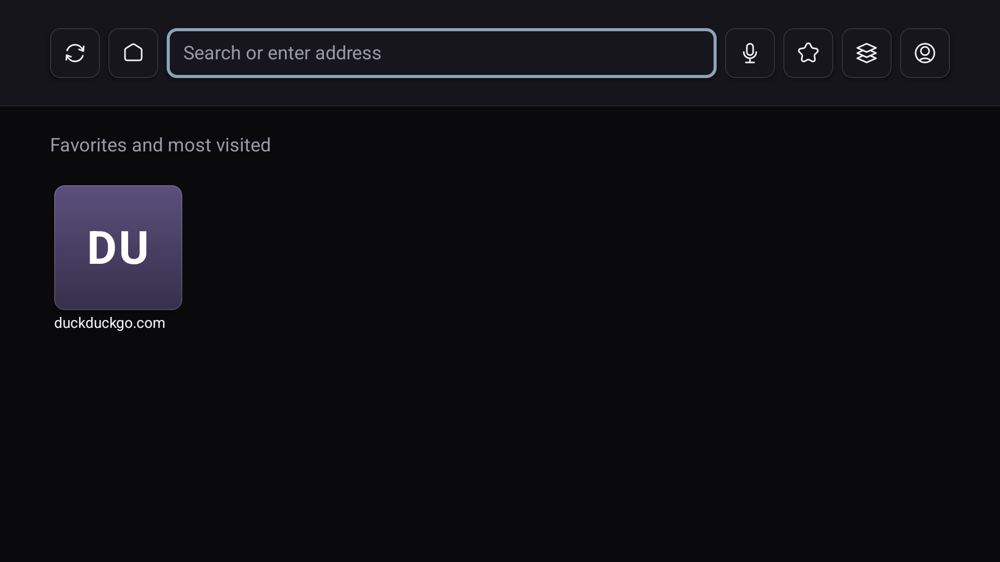

# NoMercy Browser

A web browser for Android TV that is actually operable from a remote, plays media the way a real browser does, and sends nothing about your browsing anywhere.

Most TV browsers fail in the same two places. They fake a mouse badly, so navigating any page is a fight. And they treat video as whatever the system WebView does by default, which means no fullscreen, no now playing, no audio focus and no background audio. This project treats input and media as the product rather than as details.



## What it does

Every function is reachable from six keys: the four directions, OK, and BACK. That is what a plain Chromecast voice remote gives you, and it is the floor the whole interface is designed against. Remotes with more buttons are welcome to have them, but nothing is ever hidden behind a key your remote may not have.

Media works the way you expect from a browser on a phone. Video goes fullscreen, playback publishes a real media session so transport controls and headset buttons work, audio focus is respected so the browser does not talk over other apps, and audio keeps playing when you leave the app.

Privacy is the default rather than a setting. There is no analytics code in the project and the build fails if a dependency brings any, WebView's Safe Browsing reporting is turned off, and the app never contacts a server belonging to us. Tracker blocking from public upstream filter lists is designed and not yet built; when it arrives the lists are fetched from their own sources rather than from anything of ours.

## Status

In development, and usable. Browsing, tabs, media, the home screen and the whole address bar are built and running on Android TV hardware.

What works today: an accelerating pointer driven by the D-pad with real taps and edge scrolling; tabs that survive memory pressure and rebuild themselves when the system kills a renderer; fullscreen video with a real media session, audio focus and background audio; a home screen of favorites and most visited; address suggestions drawn from what you have kept and visited; voice input from the remote's microphone; find in page; browsable kept-pages and history; per-site permissions for camera, microphone and location; downloads and a file chooser; and a desktop-or-TV switch remembered per site.

Still ahead: a native overlay for filling in web forms, screen-reader support, the tracker-blocking layer, spatial navigation inside page content, brand assets, and the Play release pipeline.

Features land slice by slice, and each slice is accepted only when everything it added can be reached using six keycodes and nothing else. The design note for each one is in [docs/design](docs/design/).

## Screenshots

One so far, above. The rest wait for two things: the features they would show are still being built, and a screenshot of a browser is mostly the site inside it, so they need a page worth putting on the page. Every shot is taken on real hardware rather than an emulator, since the whole point is how this behaves on a television.

Planned, once there is something honest to show: a page in cursor mode with the pointer on a link, video fullscreen with the now-playing session, the tab list under memory pressure, and find in page with a live match count.

## Building

You need JDK 21 and an Android SDK with platform 36.

```
./gradlew assembleDebug
adb install -r app/build/outputs/apk/debug/app-debug.apk
```

The app ships no native code of its own. One artifact runs on every processor Android TV uses, so there are no ABI splits to pick between.

## What it cannot do

Netflix, Prime Video and Disney+ refuse to serve browsers, and that is their policy rather than a limitation here. The same is true of Brave on a phone. Other services that use encrypted media play normally.

## Legal

- [Privacy policy](docs/legal/privacy-policy.md)
- [Terms of service](docs/legal/terms-of-service.md)
- [Security policy](SECURITY.md)

## License

MIT. Copyright 2026 NoMercy Labs.
